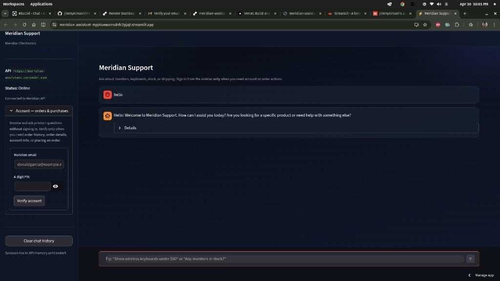

<p align="center">
  <a href="https://meridian-assistant-mpjriaxwaresd4fc2pjajt.streamlit.app/"><strong>Live app — open the Streamlit demo</strong></a>
  <br /><br />
  <a href="https://meridian-assistant-mpjriaxwaresd4fc2pjajt.streamlit.app/"></a>
</p>

# Meridian Support

AI customer support prototype for Meridian Electronics: **Groq** (Llama, tool calling) + **Meridian order MCP** (Streamable HTTP). **FastAPI** exposes `/chat`; **Streamlit** is the demo UI.

**Layout:** Application code lives in **`meridian_support/`** (API, agent, MCP client, Streamlit UI). Repo-root **`main.py`** and **`ui.py`** are thin entrypoints so `uvicorn main:app`, `streamlit run ui.py`, Docker, and Streamlit Cloud keep the same commands.

## Prerequisites

- Python **3.10+** (3.11+ recommended)
- `GROQ_API_KEY` in [`.env`](.env) (copy from [`.env.example`](.env.example)) — create a key at [console.groq.com](https://console.groq.com/)

## Run locally (two terminals)

**Terminal 1 — API**

```bash
cd "/path/to/this/repo"
pip install -r requirements.txt
uvicorn main:app --reload --host 127.0.0.1 --port 8000
```

**Terminal 2 — UI**

```bash
cd "/path/to/this/repo"
# Optional if API is not on localhost:8000
export MERIDIAN_API_URL=http://127.0.0.1:8000
streamlit run ui.py --server.port 8501
```

Open Streamlit’s URL (usually `http://localhost:8501`). The sidebar shows API health.

Test logins (exact strings): [docs/test-customers.md](docs/test-customers.md).

## UX flow

1. **Anonymous first** — users can chat about products, search catalog, and ask general questions without signing in.
2. **Verify when needed** — sidebar **Account — orders & purchases** calls **`POST /auth/verify`** (MCP `verify_customer_pin`) when they need order history, account details, or placing an order.
3. **`POST /chat`** accepts optional `session_id` (creates a new server session if missing). The agent **blocks sensitive MCP tools** until verified and asks the user to verify first.

## API

| Method | Path | Purpose |
|--------|------|--------|
| GET | `/` | Identify service (`meridian-support-api`) |
| GET | `/health` | Liveness |
| POST | `/sessions/new` | Create session |
| GET | `/sessions/{session_id}/status` | `{ authenticated, email_masked }` |
| POST | `/auth/verify` | JSON `{"email","pin","session_id"?}` — MCP verify |
| POST | `/auth/logout` | JSON `{"session_id"}` — clear auth + chat |
| POST | `/sessions/reset` | JSON `{"session_id"}` — clear auth + chat |
| POST | `/sessions/clear-chat` | JSON `{"session_id"}` — clear transcript only (keeps auth) |
| POST | `/chat` | JSON `{"message", "session_id"?}` — **anonymous OK** |

`POST /chat` response: `session_id`, `message`, `requires_auth`, `tool_used`, `confidence`.

## Environment variables

| Variable | Purpose |
|----------|--------|
| `GROQ_API_KEY` | Required |
| `GROQ_MODEL` | Optional, default `llama-3.1-8b-instant` (use `llama-3.3-70b-versatile` for heavier reasoning) |
| `GROQ_COMPLETION_RETRIES` | Optional, default `6` (each agent round retries on 429) |
| `GROQ_RETRY_BASE_SEC` | Optional, default `1.5` (exponential backoff cap 60s) |
| `MAX_TOOL_RESULT_CHARS` | Optional, default `5000` — max characters of each MCP tool result sent back to Groq (avoids HTTP 413) |
| `MCP_SERVER_URL` | Optional override for MCP endpoint |
| `MERIDIAN_API_URL` | Streamlit → API base (default `http://127.0.0.1:8000`) |
| `MERIDIAN_CHAT_TIMEOUT` | Streamlit HTTP timeout seconds (default `180`) |
| `CORS_ORIGINS` | Comma-separated origins for Streamlit (default includes localhost:8501) |
| `LOG_LEVEL` | Default `INFO` |

## Restart API after changing `.env`

```bash
./scripts/restart_backend.sh
```

Or: `make backend-stop` then `make backend` (see [Makefile](Makefile)).

## Docker Compose

```bash
docker compose up --build -d
```

- API: `http://localhost:8000`
- UI: `http://localhost:8501` (uses `MERIDIAN_API_URL=http://api:8000` inside Compose)

Pass secrets with a **local** `.env` file (gitignored) or your host’s secret manager — do not commit keys.

## Deploy (production / demo URL)

Step-by-step for **Cloud Run**, **Compose on a VM**, and checklists: **[deploy/DEPLOY.md](deploy/DEPLOY.md)**.

## Troubleshooting

- **Chat returns 429 in the UI** — Groq **rate limits**; the API **retries with backoff** automatically. Raise **`GROQ_COMPLETION_RETRIES`** / **`GROQ_RETRY_BASE_SEC`**, or send fewer messages per minute. See [console.groq.com](https://console.groq.com/).
- **`/health` works but `/chat` fails** — check **`GROQ_API_KEY`**, model id (`GROQ_MODEL`), or MCP cold start; see uvicorn logs.
- **Chat feels stuck on “Thinking…”** — first MCP catalog call after idle can take **30–90s** (Cloud Run cold start). Groq + several tool rounds add more time. Increase Streamlit **`MERIDIAN_CHAT_TIMEOUT`** (seconds) if needed; watch API logs for `chat ok … ms=`.

## Agent, guardrails, observability

| Area | In this repo today |
|------|---------------------|
| **Agent** | `MeridianAgent` (Groq + MCP) in `meridian_support/agent.py`. |
| **Guardrails** | Prompt-injection markers blocked; sensitive MCP tools require verified session; system policy for prices vs stock wording and PII; FastAPI auth routes in `meridian_support/api.py`. |
| **Tests** | `pytest` in `tests/` (`make check`); optional live run `python3 scripts/verify_tools_llm.py`. |
| **Evals** | No automated eval / golden dataset in-repo yet. |
| **Tracing** | **No** LangSmith, Langfuse, or OpenTelemetry SDK. Use Python **`logging`** to **stdout/stderr**: set `LOG_LEVEL`, run uvicorn, then read **terminal** logs locally or the host’s **log viewer** (e.g. Render **Logs**). Successful `/chat` calls log duration and `tool_used`. For real traces/spans, add OTEL (export to Honeycomb, Datadog, Grafana Tempo, etc.) or wrap the Groq client with your chosen LLM observability product. |

## Tests

Run before you push (same as `make test`):

```bash
make check
```

Or directly:

```bash
pytest tests/ -m "not integration" -v
```

**Groq + every MCP tool path (slow, real network):** with `.env` configured, run:

```bash
python3 scripts/verify_tools_llm.py
```

(`create_order` is not auto-run; use the UI when you want to exercise that tool.)

## Docs

- [docs/mcp-tools.md](docs/mcp-tools.md) — MCP tool inventory and phases
- [docs/test-customers.md](docs/test-customers.md) — test customer accounts
